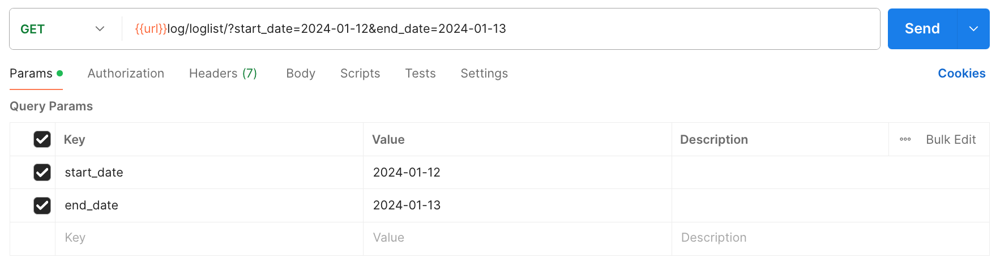

## Log
### *GET* Method
#### All Log List
````
[GET] url/log/getlist/
````

#### Filter by Date
`params` : `start_date`, `end_date`.
````
[GET] url/log/loglist/?start_date=2024-01-12&end_date=2024-01-13
````



## Category Log
### *POST* Method
````
[POST] url/log/katlog/
````
`json` :
````
{
    "nama_log" : "Registration"
}
````

### *GET* Method
#### All Category Log
````
[GET] url/log/katlog/
````

#### Category Log Details
````
[GET] url/log/katlog_detail/1
````

### *PUT* Method
````
[PUT] url/log/katlog_detail/5
````
`json` :
````
{
    "nama_log" : "Registration"
}
````