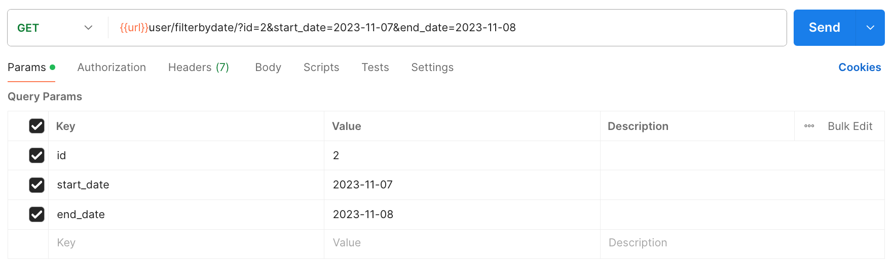

## Absensi (Checkin)
### *POST* Method
````
[POST] url/user/absen/
````
`json` :
````
{
    "iduser" : 6,
    "tagcheckin" : "Checkin (daily absences)"
}
````

### *GET* Method  
`params` : `id`, `start_date`, `end_date`.
````
[GET] url/user/filterbydate/?id=2&start_date=2023-11-07&end_date=2023-11-08
````



## Absensi (Checkout)
### *PUT* Method
````
[PUT] url/user/absen/
````
`json` :
````
{
    "ida" : 44,
    "iduser" : 63,
    "tagCheckout" : "Checkout (daily absences)"
}
````