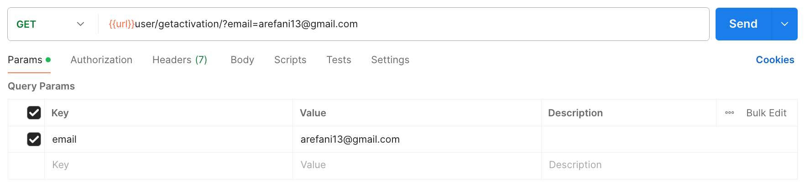
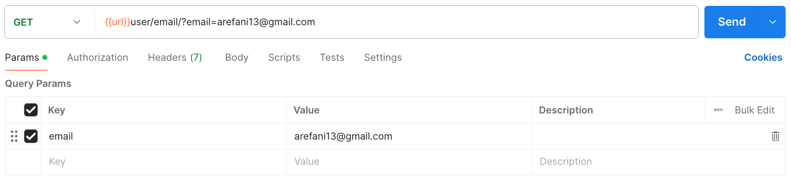

### *GET* Method
#### Get Activation
`params` : `email`.
````
[GET] url/user/getactivation/?email=arefani13@gmail.com
````



#### Email Activation
`params` : `email`.
````
[GET] url/user/email/?email=arefani13@gmail.com
````



### *PUT* Method
#### User Activation
````
[PUT] url/user/activation/
````
`json` :
````
{
    "email" : "azmir14@gmail.com",
    "code" : 90803
}
````

#### User Status Activation
````
[PUT] url/user/status_user/49
````
`json` :
````
{
    "status_user" : 1
}
````