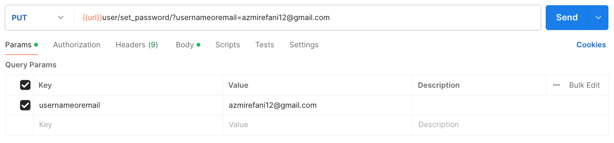

### *PUT* Method
#### Change Password
````
[PUT] url/user/changepassword/49
````
`json` :
````
{
    "password": "123123123"
}
````

#### Forgot Password
`params` : `usernameoremail`.
````
[PUT] url/user/set_password/?usernameoremail=azmirefani12@gmail.com
````


