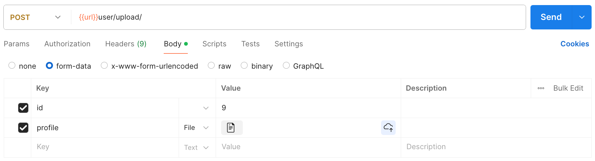
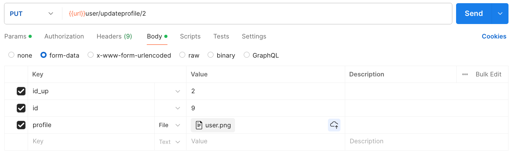

### *POST* Method
Gunakan `form-data` dibagian `body`. Lalu, dibagian `key` isi dengan field `id` dan `profile`.



### *GET* Method
#### All Profile
````
[GET] url/user/upload/
````

#### Profile Details
````
[GET] url/user/updateprofile/1
````

### *PUT* Method
Gunakan `form-data` dibagian `body`. Lalu, dibagian `key` isi dengan field `id_up`, `id` dan `profile`.

