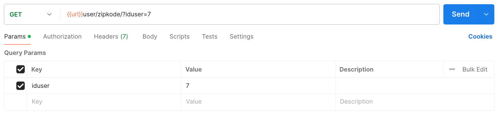
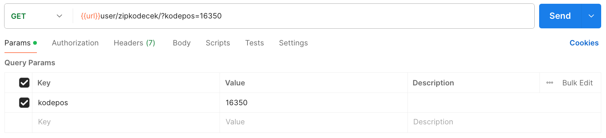

### *POST* Method
````
[POST] url/user/zipkode/
````
`json` :
````
{
    "kodepos" : "15417",
    "gol" : 1,
    "tag" : 0,
    "id_id" : 7,
    "loc" : "Pamulang 2"
}
````

### *GET* Method
#### Filter by iduser
`params` : `iduser`
````
[GET] url/user/zipkode/?iduser=7
````



#### Check Zipcode
`params` : `kodepos`
````
[GET] url/user/zipkodecek/?kodepos=16350
````

